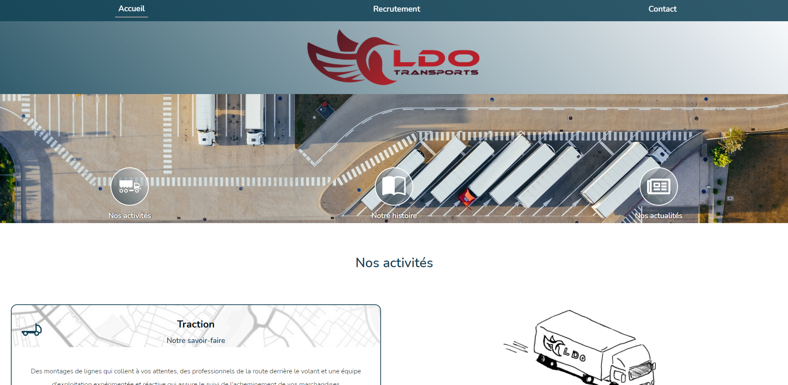
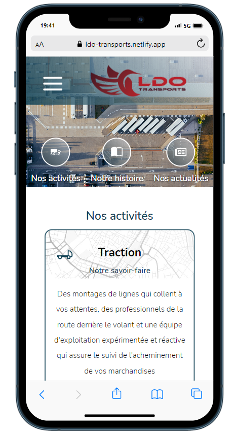

# Site web de l'entreprise LDO Transports

[Le site](https://ldo-transports.netlify.app)  
[La présentation YouTube (à 58:11 min)](https://www.youtube.com/watch?v=2S5FSWNPA5g)

#

## Projet
LDO Transports est une entreprise de transport routier toulousaine.  
Ce projet est leur site vitrine et un outil de publication de leurs offres de recrutement à destination des chauffeurs routiers.  
Les visiteurs peuvent postuler directement aux offres en ligne, depuis le site.

 

 

## Équipe

* [Thomas Capo](https://github.com/Neemko) : Product Owner / Dev Back
* [Paulo Goncalves Ferreira](https://github.com/Paulo-GF) : Lead Dev Back
* [Basile Marguerie](https://github.com/OdinAsgard) : GIT Master / Dev Front
* [Rémi Henry](https://github.com/RemiHENRY0117) : Lead Dev Front
* [Hélène Loriot](https://github.com/HeleneLoriot) : SCRUM Master / Dev Front

 

 
<strong>Stack technique</strong> 

### Gestion de projet

* Github Projects
* Git/Github pour la partie versionning et collaboration
* Architecture MVC
* Méthode AGILE

### Front-end

* React
* Sass
* React icons
* React Quill
* Axios

### Back-end

**Base de donnée** :

* Postgresql / SQL

**Migration et versionning de BDD** :

* Sqitch

**API** :

* Node.js
* Express
* Nodemailer
* Multer

**Sécurité et validation de données**

* Json Web Token
* Sanitize-html
* Cors
* Bcrypt
* Joi (pour la validation et la description de schémas d'objets)

